## Klärung der Bebauungsmöglichkeiten Bergstr. Stommeln

Die Fotos aus der näheren Umgebung sollen einen Eindruck der  vorhandenen Bebauung vermitteln.

#### Überblick Karte

###### (Gelb, X)
Grundstück Bergstr.

###### (Rot, A-L)

 Die aufgenommenen Objekte des Karrees (Bergstr. | Auf der Höhe | Potsdame Str. | Brunostr.), sowie der Zufahrt Bergstr. und benachbartes Hollandviertel (L) verfügen über zwei Normalgeschosse. Umliegende Karrees weisen ebenfalls Bebauung mit zwei Normalgeschossen vor.

#### Einzelne Gebäude

##### A - Auf der Höhe 28
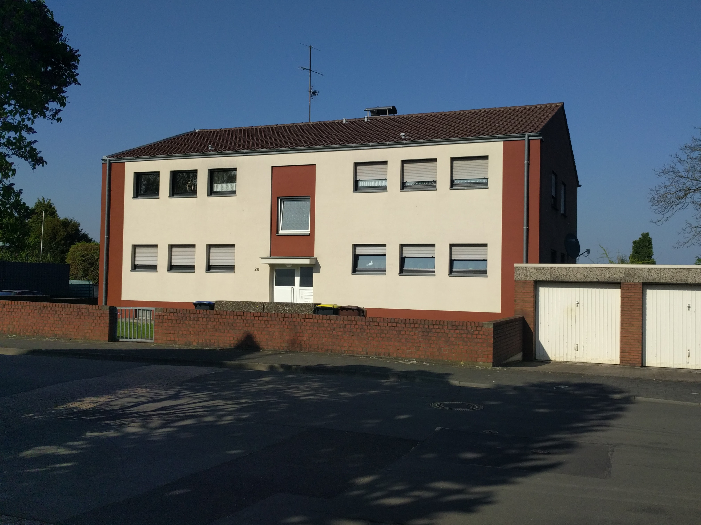

 
##### B - Auf der Höhe 33
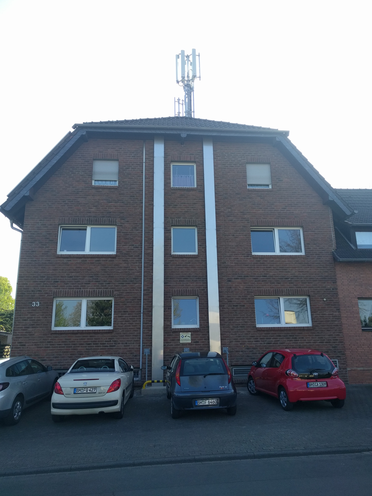

 
##### C - Auf der Höhe 31
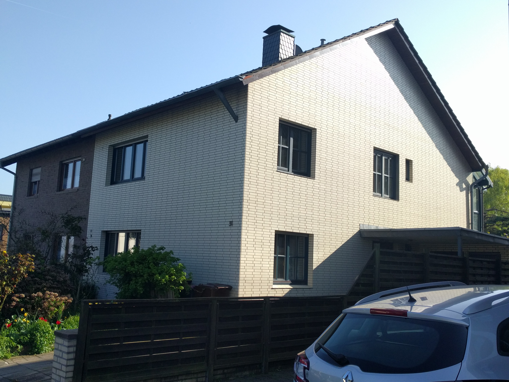

 
##### D - Auf der Höhe 25
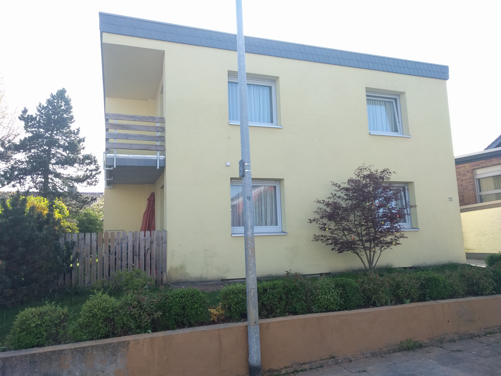

 
##### E - Auf der Höhe 23
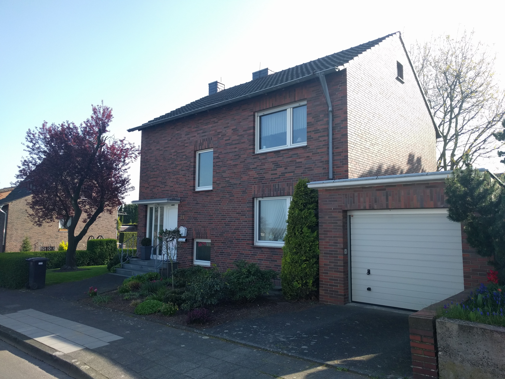

 
##### F - Potsdamer Str.
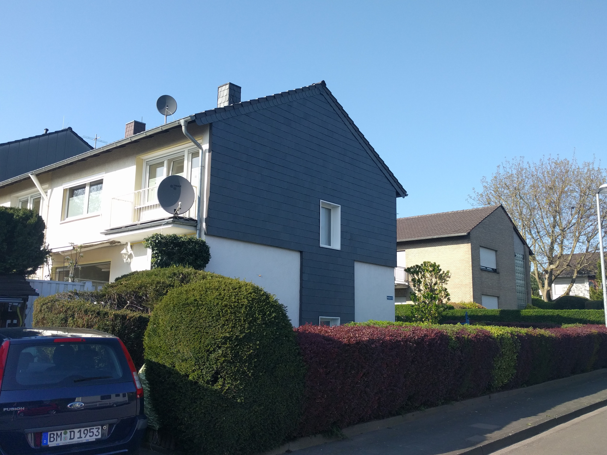
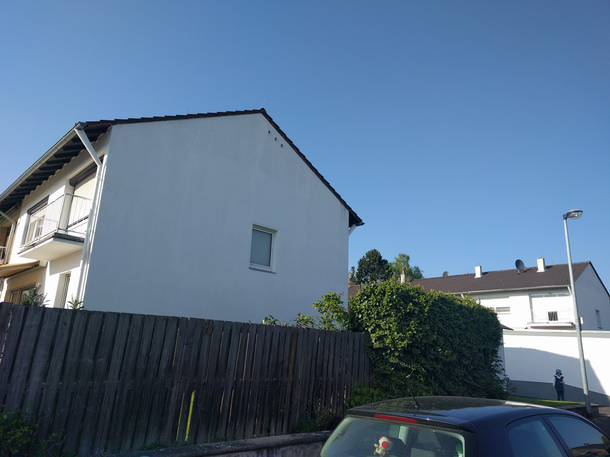

 
##### G - Brunostr. 12
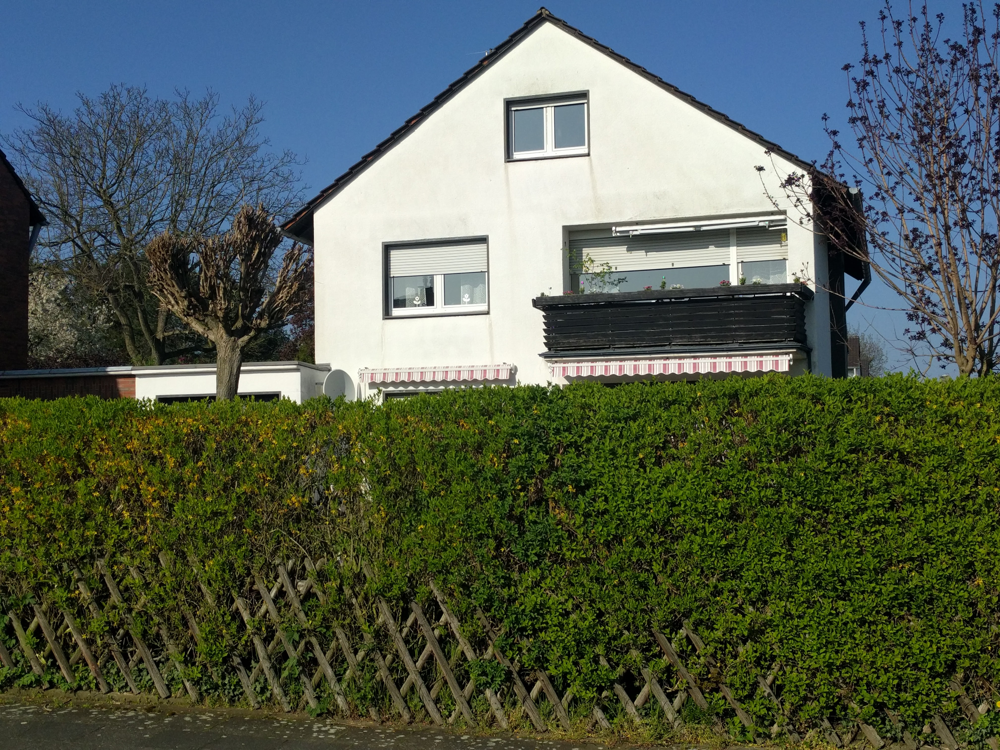

 
##### H - Brunostr. 14
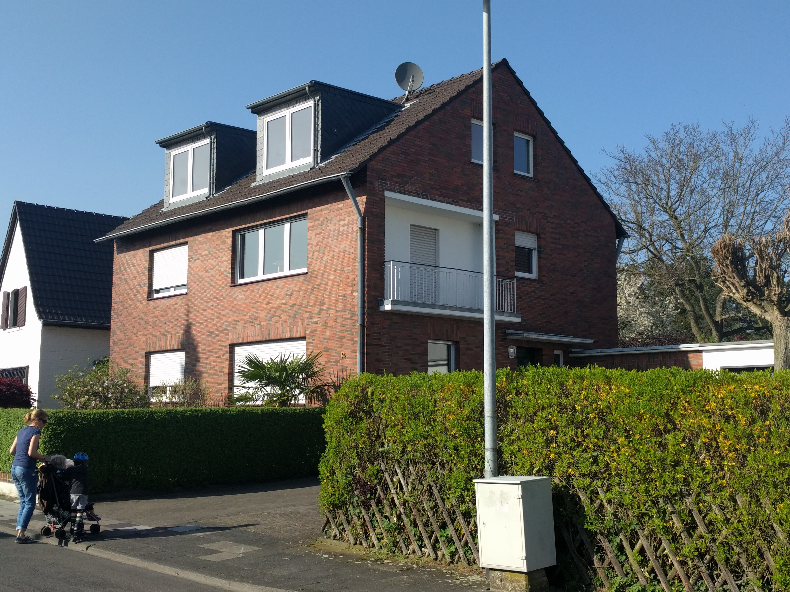

 
##### I - Brunostr. 34
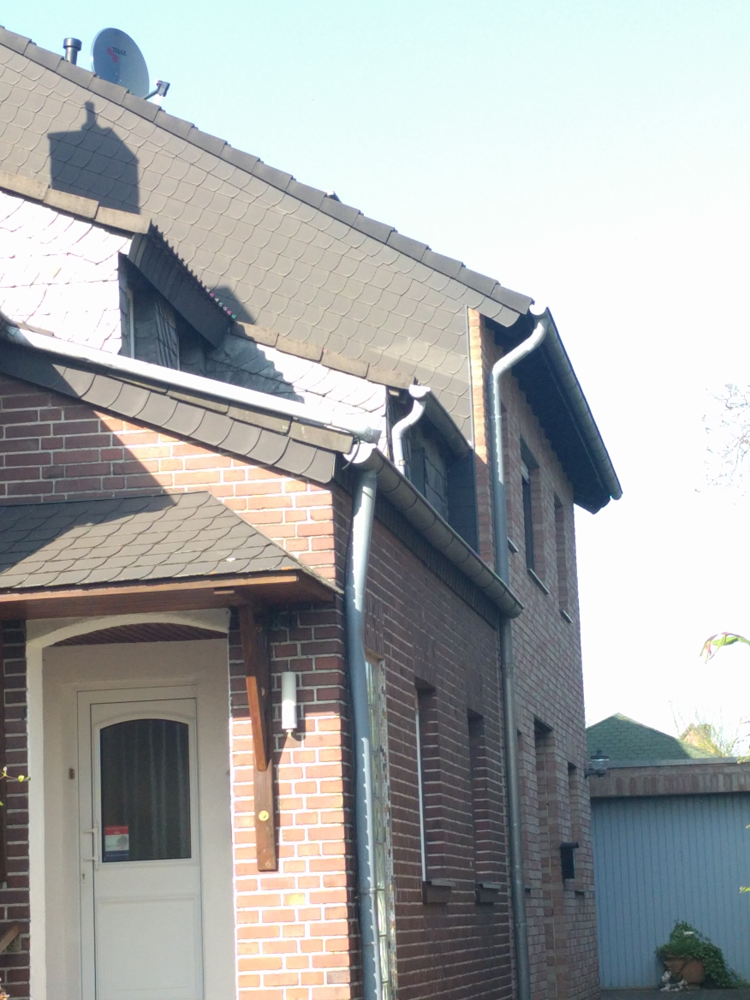

 
##### J - Brunostr. 57
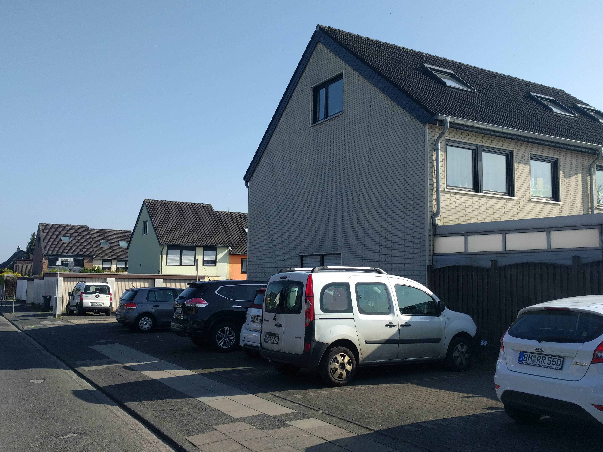

 
##### K - Brunostr. 38
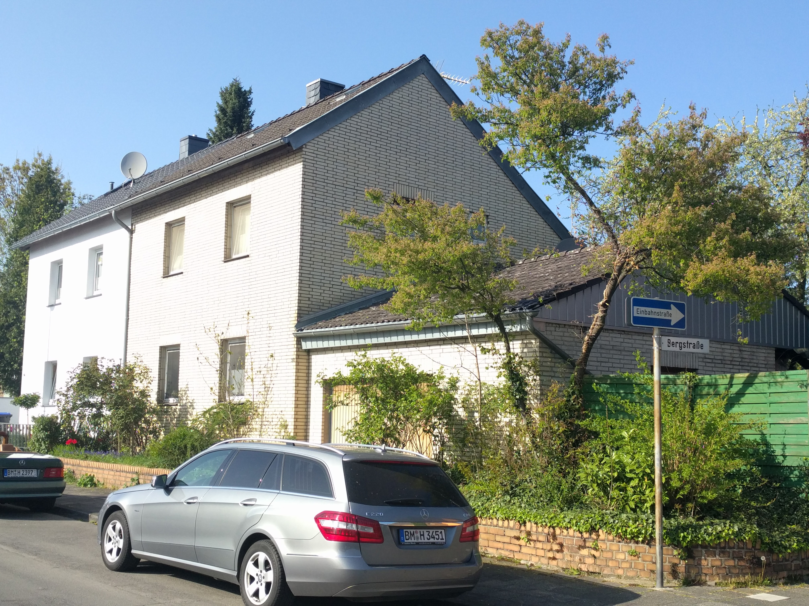
